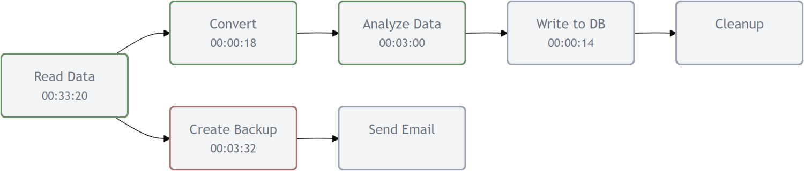

# Dagmaid

I was wondering whether you could use the [Mermaid](https://mermaid.js.org/) diagramming
tool to visualize the live progress of a workflow or pipeline similar to 
[Airflow](https://airflow.apache.org/) or [Dagster](https://dagster.io/).
It turns out you can! All you need is a bit of JavaScript:


There is also a progress-bar available that is based on the states of the blocks. See
the example.html file for how to include it:


## Usage
The principle is simple:

1.  Define a workflow or pipeline in an .mmd file using Mermaid syntax. This file is 
    meant to be generated programmatically (e.g. a Python script).
    ```
    graph LR
        Read(Read Data) --> Convert(Convert)
        Read(Read Data) --> Copy(Create Backup)
        Convert --> Analyze(Analyze Data)
        Analyze --> Write(Write to DB)
        Write --> Cleanup(Cleanup)
        Copy --> Inform(Send Email)
    ```

2.  Add a comment to the file indicating the data's recency as
    [ISO 8601](https://en.wikipedia.org/wiki/ISO_8601) timestamp.
    ```
    graph LR
        Read(Read Data) --> Convert(Convert)
        Read(Read Data) --> Copy(Create Backup)
        Convert --> Analyze(Analyze Data)
        Analyze --> Write(Write to DB)
        Write --> Cleanup(Cleanup)
        Copy --> Inform(Send Email)

    %% Status: 2025-10-05T22:00:00Z
    ```
    If the timestamp becomes older than 60 seconds, the graph will be rendered stale to 
    indicate a loss of connection:

    
    
    You can choose a timestamp far in the future to effectively deactivate this feature.

3.  Add comment lines to indicate the status of each block and how long it has been 
    running for in seconds:
    ```
    graph LR
        Read(Read Data) --> Convert(Convert)
        Read(Read Data) --> Copy(Create Backup)
        Convert --> Analyze(Analyze Data)
        Analyze --> Write(Write to DB)
        Write --> Cleanup(Cleanup)
        Copy --> Inform(Send Email)

    %% Status: 2025-10-05T22:00:00Z
    %% Read: Success (2000s)
    %% Convert: Failed (18s)
    %% Analyze: Success (180s)
    %% Write: Running (14s)
    %% Cleanup: Waiting (100s)
    %% Copy: Running (212s)
    %% Inform: Waiting
    ```
    Valid states are `Success`, `Failed`, `Running`, and `Waiting`. Blocks not mentioned are assumed to be in the `Waiting` state with an undefined runtime.

4.  Update the information in the file at least once a minute (keep the timestamp recent
    even if nothing else changes). Dagmaid reads the file in a specified interval and 
    updates the diagram in the browser. In the below example, it is set to half a second.

5.  The .mmd files must be served by a web server. If you have Python installed,
    this can be as simple as calling `python -m http.server` in the directory containing the 
    files. They will then be served at `http://localhost:8000/`.

    You can now embed the diagram in any HTML file. This is a minimal example:

    ```html
    <!DOCTYPE html>
    <html>
    <head>
        <script src="https://cdn.jsdelivr.net/npm/mermaid/dist/mermaid.min.js"></script>
        <script src="dagmaid.min.js"></script>
        <script>
            // Create diagram manager. It continuously fetches example.mmd
            const diagram = createDiagramManager('example.mmd', 0.5);

            // Initialize the DAG visualization.
            const dagCleanup = createDAG(diagram, 'diagram');

            // Start fetching and updating the diagram.
            diagram.start();

            // Clean up resources when the page unloads.
            window.addEventListener('beforeunload', () => {
                dagCleanup();
                diagram.stop();
            });
        </script>
    </head>
    <body>
        <div id="diagram"></div>
    </body>
    </html>
    ```

You can adjust the styling of the workflow within some limits by changing the CSS
styles. Have a look in example.html for the complete set of options.


    
